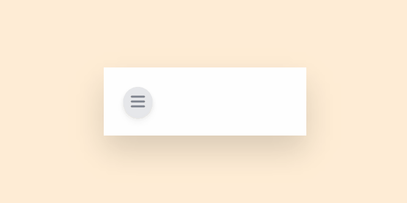
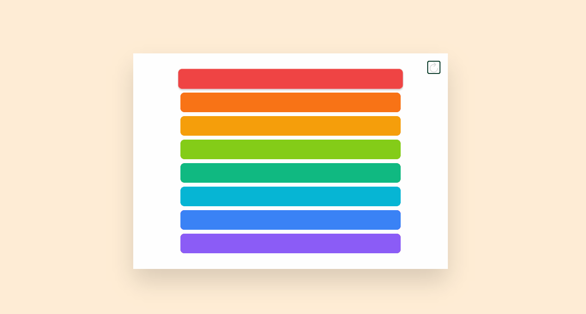
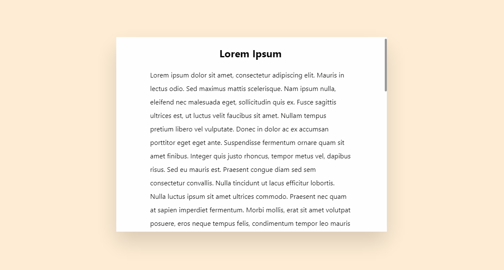
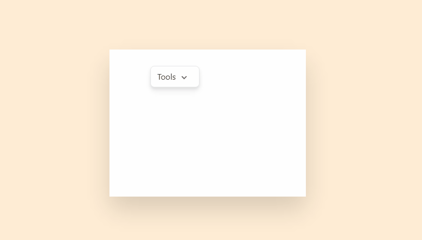

<h1>Framer Motion Example</h1>

## TL;DR

This is a collection of examples with framer-motion to create some modern ui.
I know pure CSS is powerful enough to accomplish the goal, but to me this is
much easier (without mastering CSS 😋).

## Animated Menu

## Reorder List

## Scroll Link

## Popover

